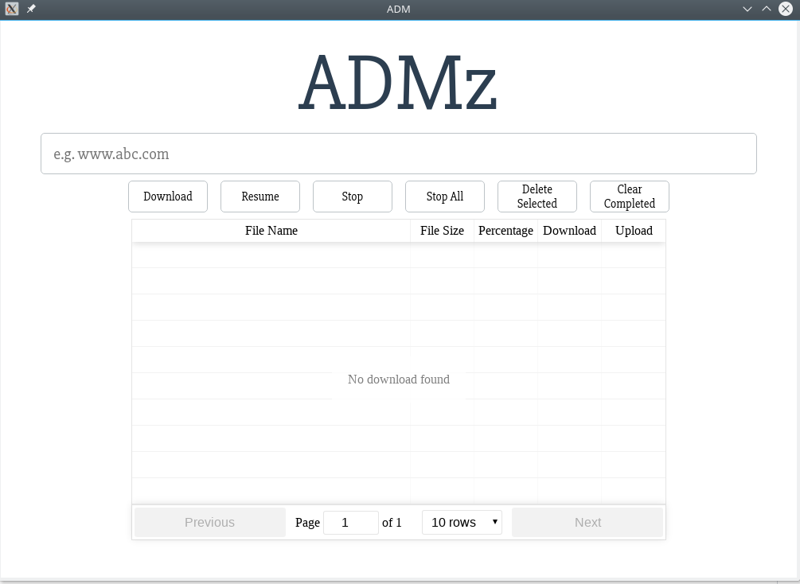

# Aria2 Download Manager

<p align="center">
  
</p>


Aria2 Download Manager is a download manager built with [electron](http://electron.atom.io), [react](https://facebook.github.io/react/) and [aria2](https://aria2.github.io).

## To Use

### Linux

Download appimage or unpacked executable in [Release](https://github.com/jk-gan/ADM/releases) and just run it.

### OSX

TBD

### Windows

TBD

## Development Build

### Pre-requisite

Follow guide from [aria2](https://github.com/aria2/aria2) to build libaria2.

### ADM Build

To clone and run this repository you'll need [Git](https://git-scm.com) and [Node.js](https://nodejs.org/en/download/) (which comes with [npm](http://npmjs.com)) installed on your computer. From your command line:

```bash
# Clone this repository
git clone git@github.com:jk-gan/ADM.git
# Go into the repository
cd ADM
# Install dependencies and run the app
yarn install && yarn gyp-rebuild && yarn build && yarn start
```

## Packaging

Check [wiki](https://github.com/jk-gan/ADM/wiki) for more information.

#### License [MIT](LICENSE.md)
